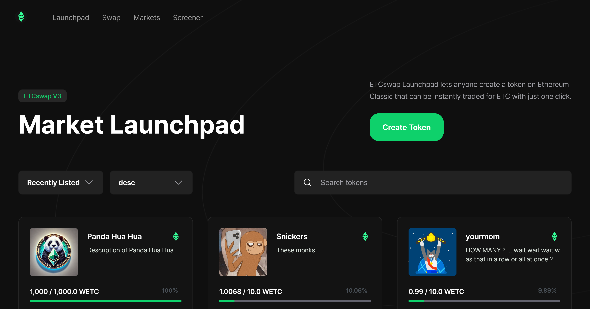
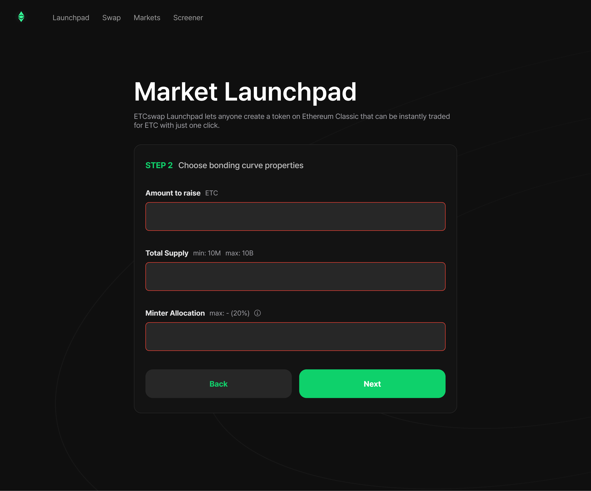
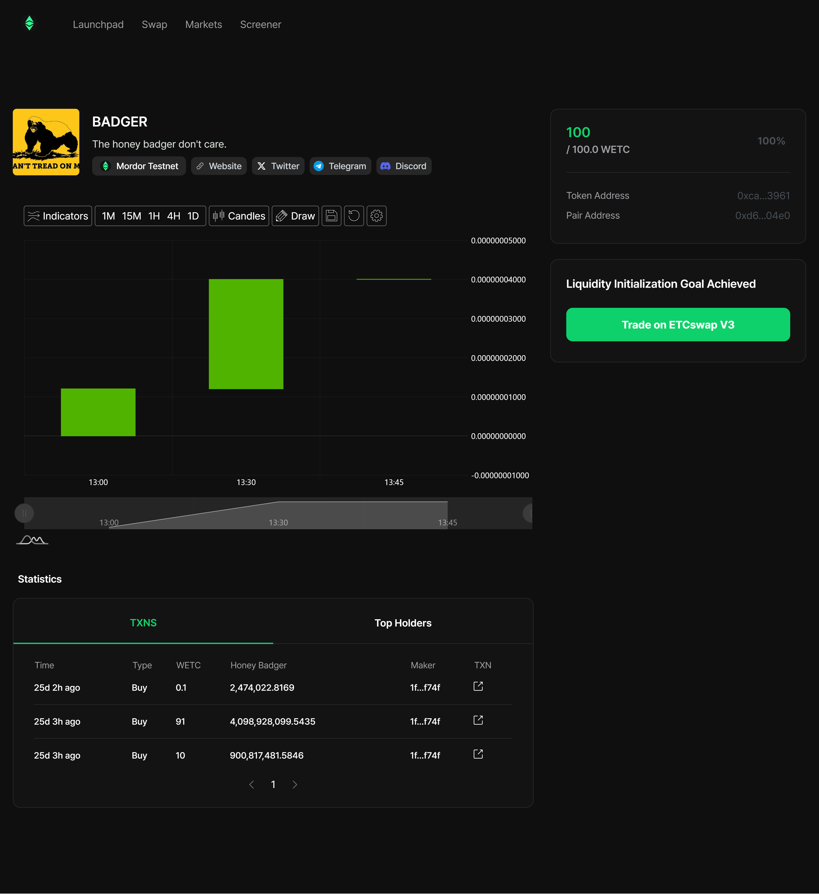
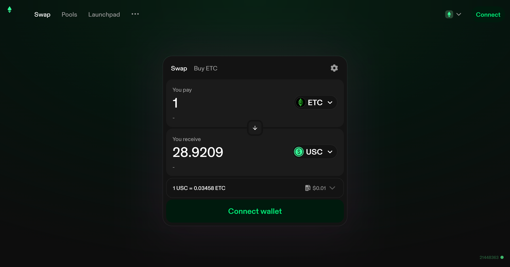

ETCswap Launchpad allows projects to efficiently raise funds and swiftly distribute tokens on decentralized exchanges (DEX). Below are the key features and how Launchpad operates:

1. The Minter inputs the properties for their project's ERC20 token using a common web form.

1. The Minter pays the gas fees, ~0.15 ETC at the time of writing, to create the ERC20 token contract and setup the Launchpad market for their Initial Liquidity Offering (ILO) event.

1. The Launchpad market is comprised of 50% of the total token supply of the ERC20 token. These tokens are sold for the amount of ETC set for the ILO raise goal.

1. When the ILO raise goal is complete, the public participants own 50% of the token supply. The remaining 50% of token supply is migrated to an ETCswap V3 pool along with the ETC that was raised during the ILO event.

1. The migrated Token and ETC liquidity is deposited into LP positions and sent to an address that lacks `SEND` functionality. This burns the LP into the ETCswap V3 pool to provide token holders a reliable DEX market.

Tokens are created with virtual liquidity (bonding curve), and it is the investors who contribute to the liquidity pool (LP) through their buys and sells.

1. Initial Market Cap
    1. The Initial Market Cap is determined by the target raising amount set by the Minter (the project creator).
    2. The Minter can set the target raising amount between 1,000 ETC to 10,000 ETC, which serves as a crucial indicator for the project's capital raising and initial valuation.
    3. The Market Cap is further influenced by the Bonding Curve, which dictates how token prices will change during the Initial Liquidity Offer (ILO) process and impacts the overall market valuation of the project.

    

2. Automatic DEX Distribution Upon Reaching the Bonding Curve Goal
    1. Once the Minter's target raising amount is achieved, the tokens are immediately deployed to ETCswap V3. This ensures investors have instant access to liquidity, allowing the project to quickly enter the market.

    

3. LP Token Burn and DEX Lock
    1. After the tokens are deployed on the DEX, the generated Liquidity Pool (LP) tokens are burned by sending the LP tokens to an known address that does not have `SEND` functionality.
    2. Once burned, these LP tokens are permanently locked in the DEX, ensuring the project's liquidity remains secured and permanently tied to the ETCswap V3 DEX. This reinforces trust and stability in the liquidity pool. This burning mechanism increases the total TVL in ETCswap V3 which benefits all V3 pools due to the Smart Router logic's ability to route trades through multiple markets to minimize slippage for users.
    
    

# Further reading

To see how token swaps work in practice, and to walk through the lifecycle of a swap, check out [Swaps](../core-concepts/swaps). Or, to see how liquidity pools work, see [Pools](../core-concepts/pools).

Ultimately, of course, the ETCswap protocol is just smart contract code running on Ethereum Classic. To understand how they work, head over to [Smart Contracts](../../reference/smart-contracts/factory).
