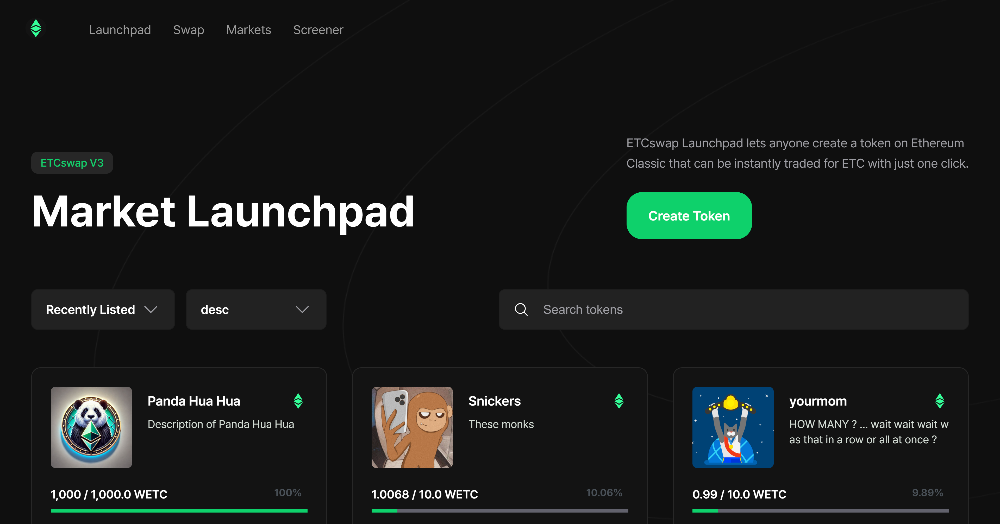

## ETCswap Launchpad

Welcome to the ETCswap Launchpad documentation.

ETCswap Launchpad allows its users to create tokens in seconds, without any required knowledge and without needing to provide liquidity.

The created token, which is free of charge except for gas fees, becomes instantly tradable on the platform.

If you are new to ETCswap Launchpad, you might want to check out the [Launchpad overview](../launchpad/concepts/protocol-overview/how-launchpad-works) first.
